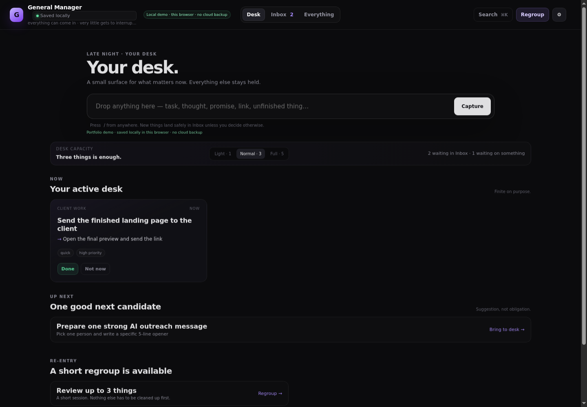
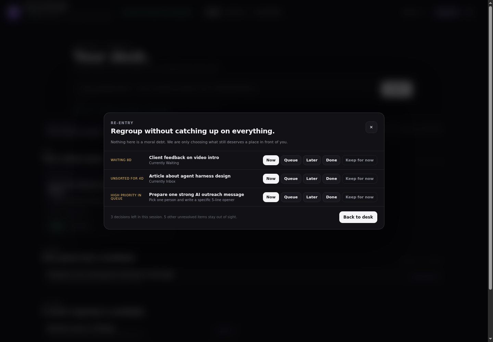
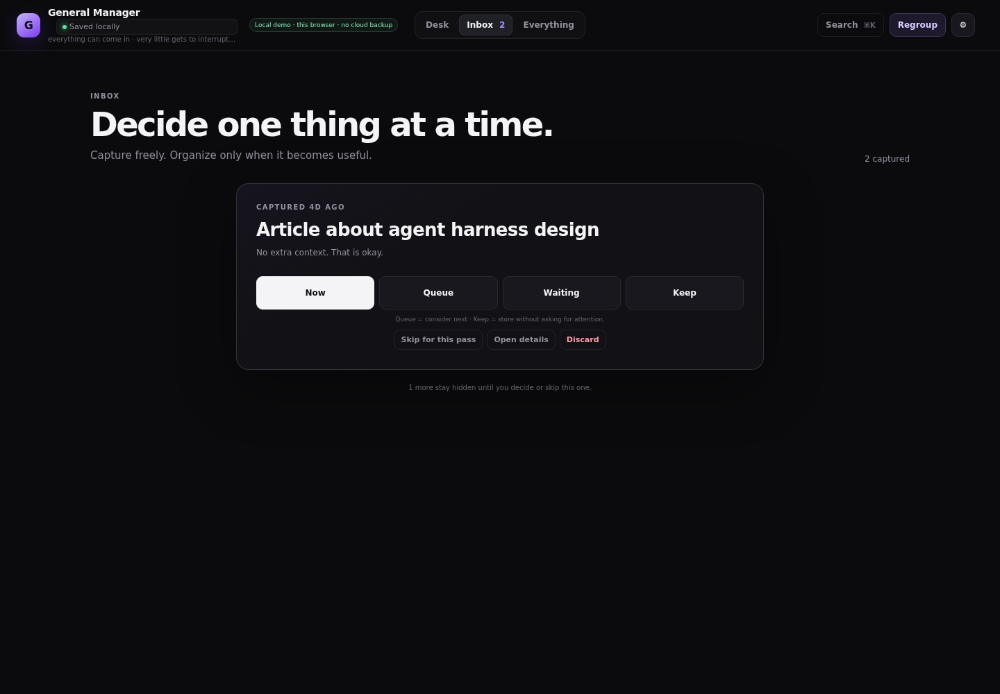

# General Manager

**General Manager separates capture from commitment and turns returning after interruption into a few deliberate decisions instead of a full cleanup session.**

It started as a Kanban/task-manager experiment. The current product direction is intentionally different: the system may contain a lot, but the user should rarely have to look at a lot.

> Everything can come in. Very little gets to interrupt you.

## Portfolio demo

Open a deployment at `/demo` (or add `?demo=1`).

The portfolio demo is deliberately self-contained:

- no account or login;
- no Firebase SDK or database request;
- no AI/API key;
- synthetic example data on first start;
- immediate local persistence in this browser;
- a single-writer browser lock prevents two demo tabs from silently overwriting each other;
- export works; import is disabled in demo mode.

The interface labels this boundary explicitly. The demo is not presented as cloud-backed or production-ready.

### Proof surfaces

**Finite Desk**



**Finite Regroup**



**One-at-a-time Inbox**



## The core interaction model

### 1. Capture first

Quick Capture asks for the thing, not its taxonomy. A task, thought, promise, link or unfinished thread can enter without choosing a project, priority or workflow first.

### 2. Commit deliberately

`NOW` is an actual commitment, not merely a card that happens to be visible. Desk capacity is enforced at the state boundary:

- Light — 1 active commitment
- Normal — 3
- Full — 5

If the Desk is full, another item cannot silently become `NOW`. Queue remains outside the commitment budget, and the Desk may show one quiet **Up next** candidate.

### 3. Triage one thing at a time

Inbox deliberately shows one captured item. The user can move it to Now, Queue, Waiting or Keep, open details, **skip it for this pass**, or discard it without counting it as completed work.

### 4. Regroup has an end

Regroup is a re-entry flow for stale work, old waiting items, aging Inbox captures and explicit date signals.

A session freezes at **at most three decisions** when opened. It does not refill from the backlog after every click. `Keep for now` and `Later` defer that decision so the same item does not immediately reappear.

The user can ignore Regroup entirely and continue working on the Desk.

### 5. Everything stays retrievable

Everything is the searchable full map. It exists for retrieval and deliberate planning, not as the default daily surface.

## What is implemented today

- universal capture with no metadata requirement;
- enforced finite `NOW` commitments;
- one Up-next Queue candidate;
- one-at-a-time Inbox triage with Skip and Discard;
- finite three-item Regroup sessions;
- snooze that removes an active item from `NOW` and returns it only as a candidate;
- local-calendar date handling for date-only deadlines;
- searchable Everything view;
- deterministic local handoff text for another person or AI tool;
- JSON export;
- responsive browser UI;
- pure core logic with Node tests;
- real Chromium behavior smoke covering capture → reload, triage, capacity and finite Regroup.

## Experimental, not part of the portfolio proof

The repository still contains an experimental authenticated/cloud path:

- Firebase email/password authentication;
- Firestore `harness-v3` storage isolated from the older board document;
- browser BYOK calls to an OpenAI-compatible endpoint;
- item-level AI helpers.

These paths are **not** what the portfolio demo relies on. Browser-stored AI credentials are not positioned as hardened secret storage, and this project does not claim production-ready multi-device synchronization.

### Source groups

The Sources surface currently **groups already stored items by origin**. It does not yet connect Gmail, GitHub, calendars, Hermes or other agents, and it does not yet compress 60 external events into one decision.

That is a product direction, not a shipped capability.

## Architecture

The browser prototype is deliberately small:

- `core.js` — pure item model, migration, commitment boundary, date logic, Regroup selection and grouping.
- `app.js` — interaction/controller layer.
- `runtime.js` — demo/runtime mode and single-writer lock.
- `bootstrap.js` — loads Firebase only for the experimental cloud mode.
- `harness-db.js` — immediate local demo persistence or isolated experimental Firestore persistence.
- `index.html` / `styles.css` — interface.
- `auth.js` / `db.js` — experimental auth and legacy compatibility boundary.

There is no framework or application backend in the portfolio demo.

## Run locally

```bash
python3 -m http.server 8080
```

Then open:

```text
http://localhost:8080/?demo=1
```

## Validation

```bash
npm test
bash tests/browser-smoke.sh
```

The core suite covers commitment limits, migration, Regroup signals, source grouping, date-only calendar semantics, snooze/deferral and deterministic handoffs.

The Chromium smoke verifies the actual portfolio flow, including:

- demo boot without Firebase;
- capture persisted across reload;
- a full Light Desk rejecting a second commitment;
- Inbox Skip revealing the next decision;
- a five-candidate re-entry scenario producing exactly three Regroup decisions with no refill;
- the demo writer lock being held.

## Product contract

[`LIFE_HARNESS.md`](LIFE_HARNESS.md) is the current product contract.

`GENERAL_MANAGER_VNEXT.md` and `MIGRATION_PLAN.md` document earlier stages of the project and are retained as development history, not current product truth.
